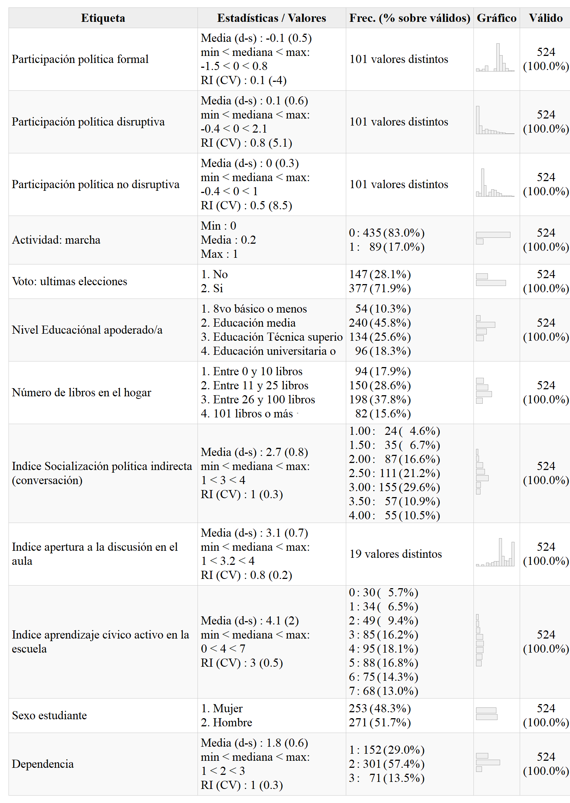

```{r setup, include=FALSE}
# if (!require("pacman")) install.packages("pacman")  #si falta pacman, instalar
# if (!require("tinytex")) install.packages("tinytex")#si falta tinytex, instalar
# if (!require("citr")) install.packages("citr")
pacman::p_load(knitr, kableExtra, dplyr, ggplot2,sjmisc,texreg) # librerias
knitr::opts_chunk$set(
	echo = FALSE,
	fig.pos = "H",
	message = FALSE,
	warning = FALSE,
	cache = FALSE,
	out.width = "85%"
)
options(scipen=999) # notacion cientifica
rm(list=ls())       # limpiar workspace
options(knitr.kable.NA = '') # NA en kable = ''
options(knitr.graphics.error = FALSE)
# Sys.setlocale("LC_ALL", "ES_ES.UTF-8")
table_format = if(is_html_output()) { # Usar en argumento "format=" de kable
  "html"
} else if(is_latex_output()) {
  "latex"
}
fwidth = if(is_html_output()) { #Usar en argumento "full_width" de kableExtra
  T
} else if(is_latex_output()) {
  F
}
```

```{r}
load(url("https://github.com/damiranda/pol_parti/blob/branch1/input/data/proc/data.RData?raw=true"))

data_red <- data %>% dplyr::select(formal,
                                disruptivo,
                                nodisruptivo,
                                act_marcha,
                                voto_apod,
                                educ_apod,
                                pad_libros,
                                conversacion,
                                apertura,
                                civico,
                                sexo,
                                dependencia,
                                region,
                                RBDE, meancivico, meanap, civico_gc, apertura_gc) %>% na.omit
```

# Introducción

En Chile, las protestas producidas en las revueltas de octubre de 2019 y el aumento de la participación electoral en el Plebiscito Constitucional del 2020 han reactivado el tópico de la participación política en la discusión académica. Esto pues, durante este periodo de tiempo convivieron distintos modos de comportamiento cívico y diferentes expresiones de lo político, desde movilizaciones de carácter activista, que son modos extrainstitucionales de influir en los asuntos públicos, hasta votaciones masivas, que son la definición de la participación política formal. La mayoría de este repertorio de prácticas fue protagonizado por jóvenes estudiantes.

La participación política es un proceso de aprendizaje, especialmente en jóvenes. La participación política de la juventud es sin duda un tema muy relevante para el funcionamiento actual y futuro de las democracias. Investigaciones previas sobre el tema en América Latina e internacionalmente han permitido concluir que existen dos desafíos relevantes para la comprensión de este fenómeno: la constante diversificación de los repertorios de las formas de participación y los modos en que las nuevas generaciones adquieren su comportamiento político. En ese punto toma relevancia la comprensión de la socialización política juvenil en el marco de distintos modos de participar políticamente.

La socialización política se define como la influencia en el interés de la ciudadanía por la participación en la política a través de diversos agentes. En la literatura sobre la temática se ha escrito sobre distintos agentes de socialización política. Tal es el caso de los medios de comunicación, las amistades, las familias y las escuelas. Así, algunos de los factores que inciden en el interés  por la participación ciudadana se heredan intergeneracionalmente, a través de la socialización política familiar, y otras se adquieren en etapas posteriores del curso de vida, específicamente en colegios y liceos.

Cuando el interés por la participación política se reproduce dentro del contexto familiar los académicos del área hablan de transmisión intergeneracional de la participación política, que se define como la herencia del interés por la participación política y de sus preferencias desde los padres/madres/apoderados hacia jóvenes de nuevas generaciones. Así, en la sociología y la ciencia política se ha indicado que la transmisión intergeneracional es un fenómeno que produce desigualdad entre jóvenes de distintos grupos sociales, esto puesto que se ha demostrado que familias con mayor niveles de politización o con mayores recursos económicos y culturales traspasan en mayor medida sus prácticas políticas a sus descendencias, en desmedro de jóvenes con familias menos comprometidas políticamente o con menores recursos.

A su vez, en las ciencias sociales se ha investigado el papel que juega el agente socializador “escuela” en esta desigualdad. Particularmente se ha estudiado el efecto moderador o potenciador que tiene la socialización política escolar sobre la transmisión intergeneracional de la participación, demostrando para el caso de aquellas con mayores prácticas de socialización política o con mayores niveles de apertura a la discusión, esta desigualdad disminuye o se ve mitigada por la institución escolar.

En este contexto, resulta interesante preguntarse cómo opera la idea de transmisión intergeneracional de la participación política en la juventud chilena, teniendo en cuenta aspectos como los distintos repertorios de participación que exhiben los jóvenes y el efecto moderador que tiene la escuela en esta relación. De esta forma, las preguntas de investigación que guiarán el artículo son las siguientes:

a) ¿En qué medida las prácticas políticas parentales, los recursos socioeconómicos de la familia y la socialización política escolar inciden e n la participación política de los jóvenes?

b) ¿Qué papel juega la escuela, como agente mitigador o regulador, en la asociación entre los recursos y socialización política parental sobre la participación política de los jóvenes chilenos?

## Participación política

La participación política es un concepto de una larga discusión académica. Una de las definiciones que despierta más consenso sobre este concepto tiene que ver con la acción o las actividades cívicas de los ciudadanos ordinarios dirigidas hacia la obtención de resultados políticos [@ekmanPolitical2012; @vandethconceptual2014]. En particular, la participación política también se ha definido como las prácticas voluntarias por las cuales la ciudadanía comunica sus intereses, preferencias y necesidades a los políticos de una democracia determinada, prácticas que también funcionan como un mecanismo de ejercer presión para obtener una respuesta del sistema político a demandas ciudadanas [@vandethStudying2001; @vandethconceptual2014; @parryPolitical1992; @schlozmanCivic1999].

Si bien en gran parte de la discusión académica este esquema conceptual genera consenso, el repertorio de acciones políticas que integran lo que se conoce como participación política o ciudadana en cada investigación social difiere, ya sea por motivos teóricos, metodológicos y/o por disponibilidad de datos sociales. Por estos motivos, en la investigación sobre participación política es importante conocer de manera abstracta que vamos a entender por este concepto, así como también es relevante establecer los límites de los que se entenderá como ‘repertorios’ o ‘tipos’ de prácticas de participación [@vandethconceptual2014].

En este sentido, así como existen estudios donde reducen el concepto de participación política a la acción de votar, hay otros estudios que agregan las formas de participación que se conocen como ‘entre votaciones’, es decir, aquellas prácticas de participación que se realizan en los tiempos políticos en que no hay elecciones populares de representantes [@ekmanPolitical2012;@verbaParticipation1978]. Algunas tipologías de prácticas de participación política distintas a la formal-institucional son las siguientes: el consumo político, el boicot, las actividades de protesta, el activismo cívico –tanto legal como ilegal-, la participación en organizaciones voluntarias o comunitarias, entre otras [@ekmanPolitical2012;@vandethconceptual2014].

Este modo de entender la participación política permite integrar como sujetos participantes de la arena política a aquellos que no cuentan con ciudadanía legal o quienes sienten desconfianza o desilusión de las formas tradicionales de participar en política, grupos dentro de los cuales generalmente se encuentran los jóvenes, quienes en estudios anteriores han demostrado tener menores niveles de voto que las generaciones que les anteceden y mayores niveles de participación de tipo activista o de protesta [@sloamRejuvenating2011].

De esta manera, las prácticas que esta investigación define como modos de participación son las siguientes. Por una parte está la participación política formal, que se define como la forma clásica de entender la participación ciudadana, basada en el ejercicio del voto en elecciones de representantes. Por otro lado está el activismo, que es la búsqueda de influir en los asuntos públicos a partir de métodos extrainstitucionales y/o no convencionales, por ejemplo, a través de protestas o manifestaciones [@ekmanPolitical2012;@mirandaYoungCitizensParticipation2020]. Dentro del activismo se pudieron observar dos prácticas de participación claramente distinguibles para efectos analíticos: el activismo no disruptivo, que hace mención a fórmulas de participación no violentas o que desde un punto de vista normativo se consideran legales por la institucionalidad, y también se observó el activismo disruptivo, que por el contrario, refiere a los modos de participación violentos o caóticos, y que desde un punto de vista institucional, se consideran ilegales [@ekmanPolitical2012; @hoskinsEducation2019].


## Socialización política familiar

La familia cumple un rol fundamental en la socialización de las nuevas generaciones, esto pues, tanto los padres como las familias extendidas entregan herramientas fundamentales para interpretar y ‘navegar’ en el mundo social y político [@muddimanYoung2019]. De esta forma, los hogares son los espacios privados en donde se aprende a interactuar con lo público y lo comunitario, pero también es el lugar donde primariamente se recibe instrucción sobre métodos de participación política y compromiso cívico-social, por lo cual, se puede entender como un importante agente de socialización política [@andolinaHabits2003; @nesbitInfluence2013].

En este sentido, la socialización política familiar se comprenderá como la transmisión del conocimiento cívico y de la participación política facilitados por el contexto familiar. Este agente de socialización política se sustenta en que el hogar es uno de los espacios de reproducción social en donde primero se enseña y aprende, verbal y discursivamente, sobre métodos de participación y compromiso político, por lo que, hogares con mayores niveles de prácticas de socialización política familiar tenderán a formar a jóvenes con mayores niveles de participación [@andolinaHabits2003; @quintelierEngaging2015].

Para efectos de este estudio, se distinguieron dos tipos de socialización política familiar: la socialización política familiar directa (SPFD) y la socialización política familiar indirecta (SPFI). Por una parte, la socialización familiar directa se presenta cuando las familias de los jóvenes están comprometidas políticamente. Particularmente sucede cuando los niños crecen en un ambiente familiar políticamente activo, lo que lleva a jóvenes a participar en actividades políticas desde pequeños y desarrollar habilidades políticas tempranamente [@mcfarlandBowling2006; @quintelierEngaging2015]. Investigadores que han utilizado el concepto indican que el tener familiares involucrados en política conduce a una mayor participación política juvenil, por otro lado, concluyen que el tener un familiar activo políticamente a los 16 años (edad que concierne al sujeto de esta investigación) conlleva a desarrollar mayores niveles de participación política en el futuro [@quintelierEngaging2015].

Por otra parte, la socialización familiar indirecta ocurre cuando en un contexto de familia se discute y dialoga con frecuencia sobre temas relacionados con la política y la actualidad, lo que facilita una transmisión intergeneracional del lenguaje político, de las preferencias y del interés por la política. En investigaciones relacionadas se ha encontrado que la conversación intergeneracional sobre asuntos públicos puede tener una influencia positiva en el compromiso cívico, el conocimiento político y la participación de los jóvenes [@hoskinsEducation2019; @mcintoshInfluence2007]. Así, también se ha demostrado en algunas investigaciones que en familias donde más se conversa sobre política, mayor predisposición hay para inscribirse en registros electorales y participar en los asuntos públicos de un país, caso contrario en aquellas familias en que menos se dialoga sobre estas temáticas [@mcintoshInfluence2007; @quintelierEngaging2015].

## Modelo de recursos culturales

Las herramientas que entregan las familias para la interpretación y análisis del mundo social y político están, a su vez, atravesadas/determinadas por los recursos socioeconómicos y culturales con los cuales cuentan dichos núcleos. La bibliografía especializada hace hincapié particularmente en aquellas características que presentan los hogares en los que viven los niños y jóvenes respecto a los procesos, contenidos y dinámicas vinculadas a la socialización y participación política [@hoskinsEducation2019; @naterasInformacion2007]. Diversos autores han probado que existe una relación muy marcada entre los recursos culturales y educacionales familiares y la transmisión intergeneracional del compromiso político de los jóvenes, en tanto las dinámicas en los que se encuentran inmersos son producto de “complejos mecanismos de influencia y construcción sociales, concretados a través de mediadores o agentes socializantes” [@naterasInformacion2007, pág. 1360]

Tal como la socialización política explica en cierta proporción la participación política juvenil, las desigualdades de origen también se heredan intergeneracionalmente, por lo que, se vuelve necesario el análisis de otros factores. En otras palabras, al momento de observar las dinámicas de socialización política, es menester considerar diversos elementos vinculados con el nivel socioeconómico y cultural presentes en el espacio familiar, así como el nivel de exposición a información y cultura a la cual se ven expuestos los jóvenes.

Sin ir más lejos, el nivel educativo de los padres es un elemento crucial para comprender este fenómeno. Como punto de partida, se ha demostrado que cuando existen diferencias en los niveles de escolaridad de los padres, “las habilidades analíticas que suelen adquirirse de manera natural con la exposición a niveles medios y superiores de educación”, y estos son difícilmente remontables por parte de los jóvenes que han sido criados en contextos con niveles de escolarización más bajos. Además, un mayor nivel educativo propicia no solo mayor comprensión y habilidades para el aprendizaje, sino que también suscita recursos culturales y educativos que se transmiten intergeneracionalmente a los más jóvenes. Por el contrario, las características permanentes encontradas en hogares de escolares de bajo nivel socioeconómico, “influyen adversamente en el desarrollo cognitivo y psicosocial de sus integrantes, limitando la experiencia cognitiva” [@jadueCaracteristicas1996, pág 37]. Como explica la autora, las condiciones materiales de los hogares pobres no permiten que estos centren su atención en temáticas abstractas como la política, ya que se ven obligados constantemente al despliegue de estrategias de supervivencia para sortear las dificultades materiales que atraviesan. Por ende, no es sorpresa esperar que los recursos culturales de dichos hogares sean mínimos o inexistentes, lo que difícilmente propiciaría el ambiente para desarrollar interés en la política y para la participación política de los jóvenes.

Algunas razones para explicar este fenómeno se pueden resumir en que los padres de familias con mayores niveles culturales “pueden proporcionar a sus hijos acceso a recursos adicionales de información cívica como libros, revistas, periódicos, medios electrónicos” [@mcintoshInfluence2007, traducción propia]. Los libros como recurso cultural serán una pieza clave para esta investigación, en tanto se parte de la primicia de que una mayor cantidad de libros indicaría un mayor nivel educativo, y por consiguiente, un mayor interés por la política. El contacto estrecho con la política desde edades muy tempranas en niños motivaría que presten atención a tópicos de dicha naturaleza, lo que implica que este interés se ve incrementado, según Nateras “en función de su desarrollo sociocognoscitivo, y de sus características socioeconómicas y culturales” [@naterasInformacion2007, pág. 1359]

## Socialización política escolar

Al igual que la familia, se ha demostrado la necesidad de analizar otros factores y escenarios de socialización que actúen como agentes mitigadores, reguladores o potenciadores de las relaciones entre los elementos antes expuestos, y ver cómo media las desigualdades de origen que permean la participación política de los sujetos. La evidencia empírica ha demostrado la influencia de ciertos elementos propios de la escuela que determinan la participación de los jóvenes, reconociéndose ampliamente el valor del clima de aula y la apertura a la discusión por parte de docentes y otros actores, así como la educación cívica propiciada por el establecimiento.

La participación política suscitada por el espacio escolar provee de herramientas políticas a los jóvenes, ya que el primer tipo de educación ciudadana es la educación cívica [@quintelierEngaging2015]. No obstante, “las experiencias escolares parecieran adquirir un sentido diferente de acuerdo con el tipo de institución de la que se trate” [@nunezDEMANDAS2021], incidiendo en el ejercicio político. Es a través de la interacción dentro de espacios socializadores comunitarios donde se reafirman, potencian o nivelan los compromisos políticos de los jóvenes, en palabras de Rodriguez Bustamante, quien declara la influencia positiva de la escuela en dicha relación ya que la implementación de instancias democratizantes simuladas, como la elección de representantes estudiantiles, resultan fundamentales para el aprendizaje político y ciudadano de los sujetos [@rodriguezbustamanteParticipacion2020].

En esa línea, estudios en Chile reportan resultados similares, y es que un ambiente donde se propicie la discusión, el debate, la exposición de ideologías, entre otras formas de participación, mitigan las diferencias socioeconómicas de origen [@ascorraParticipacion2016; @castilloMitigating2014; @castilloSocial2014a]. En tanto se trata de formas de participación, este punto incide sin lugar a dudas en los sentidos asociados al ejercicio de derechos y la ciudadanía. Se ha demostrado que los estudiantes de escuelas carentes de instancias de simulación democrática o deliberación comunitarias ven mermadas las posibilidades de plantear demandas y exigencias comunes, proyectándose en la participación política a futuro [@ascorraParticipacion2016; @quintelierEngaging2015].

La socialización política escolar, de esta manera, incluiría prácticas que varían desde la votación en instancias deliberativas de representantes políticos escolares, hasta un ambiente donde se propicia la discusión y el debate. Estudiar los efectos mitigadores de la escuela, reconociendo la autonomía de los jóvenes, es importante para entender su agencia y empoderamiento, en tanto sus contextos políticos, económicos y sociales marcan la percepción de justicia y los niveles de interés y compromiso político [@hartungYoungCitizenNew2017]. De este modo, es importante analizar este elemento considerando la potencialidad de la escuela como categoría presente en el proceso o los procesos democratizadores de las escuelas, y cómo estos elementos de origen suscitan una desigual transmisión intergeneracional en la participación política, y las prácticas asociadas a la misma.

## Hipótesis

De esta forma, las hipótesis de la investigación son las siguientes:

H1.  Jóvenes  provenientes  de  familias  con  mayores  niveles  de socialización  política familiar presentarán mayores niveles de participación política.

H2a.  Jóvenes  que  crecen  en  familias  con  mayores  recursos  socioeconómicos  y culturales   presentarán   mayores   niveles   de   participación   política   formal   y   activista   no disruptiva.

H2b.  Jóvenes  que  crecen  en  familias  con  mayores  recursos  socioeconómicos  y culturales presentarán menores niveles de participación política activista disruptiva.

H3.  Jóvenes  que  asisten  a  escuelas  con  mayores  prácticas  de  socialización  política presentarán mayores niveles de participación formal y activista no disruptiva.

H4. En escuelas que desarrollan mayores niveles de socialización política, la asociación entre la  socialización  política  familiar con  los  niveles  de  participación  de  los  jóvenes  será menos intensa.

H5. En escuelas con mayores niveles de socialización política, la asociación entre los recursos socioeconómicos y culturales de  la  familia con  los niveles de participación de estos jóvenes será menos intensa.

# Metodología y Datos

Se testearon las hipótesis utilizando los datos producidos por la Encuesta PACES, la que considera 1635 estudiantes de II° Medio (o décimo grado en otros países), anidados en 64 escuelas de las regiones de Antofagasta, Metropolitana de Santiago y del Maule. Los datos incluyen a docentes (103) y apoderados (744) de las respectivas escuelas. Los datos fueron producidos entre agosto y diciembre del año 2019. Luego filtrar la base de datos, la muestra con la que se trabajó resultó en 524 estudiantes y 60 escuelas.

Para la realización de los análisis se realizó un análisis descriptivo y bivariado de los datos, generando una tabla de descriptivos y una matriz de correlaciones para todas las variables sustantivas. Posteriormente se estimaron una serie de regresiones multinivel para cada una de las variables dependientes, el cual es capaz de entregar nociones de la naturaleza de las relaciones en nuestros datos que, de otro modo, no podrían detectarse [@finchMultilevel2019].

Para efectos del análisis, en primer lugar se observaron las regresiones de mínimos cuadrados ordinarios (OLS, por su sigla en inglés) para estimar la relación entre las variables de nivel 1 y de nivel 2, con las variables dependientes (Hipótesis 1, 2 y 3). En segundo lugar, se realizó un test ANOVA con el objetivo de liberar pendientes de las variables de nivel 1 y saber si son aleatorias respecto a las escuelas. Si las variables de nivel 1 eran aleatorias, se procedía a un análisis de interacción entre variables, para someter a prueba las hipótesis 4 y 5. Este análisis cuantitativo se realizó con el programa de análisis de datos R y con el paquete Lme4.

En las primeras tres hipótesis, de interacción a nivel individual, se observará en qué grado las prácticas de socialización política familiar (H1) y los recursos familiares (H2a y H2b) explican la participación política juvenil formal, activista disruptiva y activista no disruptiva. Las siguientes hipótesis, de nivel contextual, se observarán los efectos de las prácticas de socialización política escolar (H3) y los efectos de moderación que la escuela tiene en la asociación entre los recursos y socialización política parental sobre de las desigualdades de origen en la participación política de los jóvenes chilenos (H4 y H5).

Esta investigación fue prerregistrada en la plataforma OSF [^1].

[^1]: Prerregistro público en este estudio en: https://osf.io/2phu9/. 

## Variables dependientes

En la literatura especializada fue posible distinguir distintos modos de participación política dentro de los cuales esta investigación decide quedarse con tres: participación formal, participación activista no disruptiva y participación activista disruptiva [@hoskinsEducation2019; @mirandaYoungCitizensParticipation2020]. Para construir estas variables se crearon tres índices a partir de puntajes factoriales, devenidos de un Análisis Factorial Confirmatorio. Para la construcción de la participación formal en el modelo factorial se utilizaron variables proxy de participación, es decir, intención de voto en elecciones presidenciales, intención de voto en elecciones municipales e intención de informarse sobre los candidatos de estas elecciones. Se utilizaron variables de intención de participación y de información ya que los estudiantes al no cumplir la mayoría de edad (18 años en Chile) al momento de encuestárseles, aún no estaban habilitados para participar en elecciones formales en Chile. La participación no disruptiva se identificó con cuatro variables de participación en las que efectivamente habían participado los estudiantes, estas fueron: participación en marchas autorizadas, participación en reuniones políticas, participación en recolección de firmas y participación en actos comunitarios. En tanto, la participación activista disruptiva se compuso de cuatro variables de participación efectiva: participar en bloqueo de calles, pintar paredes, participar en ‘tomas’ y participar en marchas no autorizadas.

Según los criterios de [@brownConfirmatory2015a] el ajuste del modelo factorial confirmatorio empírico propuesto se ajusta de manera óptima al modelo teórico de los distintos modos de participación política. Esto pues, los indicadores de ajuste son aceptables. El Root Mean Square Error of Aproximation (RMSEA) que es un índice de ajuste absoluto y que mientras sea menor al valor 0,05 indica un ajuste óptimo (en este caso, 0,022). El Comparative Fix Index (CFI), que compara el ajuste del modelo en relación a un modelo nulo y que mientras más cercano a 1, mejor es el ajuste global del modelo (en este caso, 0,997). Por último, el valor p asociado al chi square test, que mientras más se acerque a cero, indicará menores diferencias entre el modelo propuesto con el modelo teórico.

## Variables independientes

Las variables de socialización política familiar se definieron como en la teoría, separando la socialización directa de la indirecta. Para evaluar la socialización política directa se utilizaron variables “espejo” con el objetivo de evaluar la relación entre las prácticas de participación política formal de los padres / apoderados con las de sus hijos, y por consiguiente, también evaluar la relación entre las prácticas de participación política activista de los padres /apoderados con las de los hijos. Para ello, se utilizaron dos indicadores dummy de participación formal y activista de los padres: “¿Votó en las últimas elecciones presidenciales de noviembre de 2017?” y “¿Usted ha realizado alguna de las siguientes actividades durante los últimos 12 meses? Participar en una marcha o manifestación".

La socialización política familiar indirecta es un índice sumativo que se generó a partir de dos variables devenidos de un mismo ítem: frecuencia de conversación entre padres e hijos sobre temáticas sociopolíticas y frecuencia de conversación entre padres e hijos sobre temáticas de actualidad. Ambas tenían como categorías de respuesta: nunca, casi nunca, a veces y siempre.

El modelo de recursos culturales se conformó por dos variables: nivel educacional de los padres, en donde se utilizó la variable reportada por los padres / apoderados de los estudiantes, con las categorías: 8vo básico o menos, educación media, educación técnica y educación universitaria. Y número de libros en el hogar, el cual fue reportado por los padres / apoderados de los estudiantes y que contó con las siguientes categorías: Entre 0 y 10 libros, Entre 11 y 25 libros, Entre 26 y 100 libros y 101 libros o más. Esta última categoría fue una recodificación de la variable original, que además contaba con las categorías: Entre 101 y 200 libros, Entre 201 y 500 libros y Más de 500 libros.

Para las variables de socialización política escolar se generaron dos índices, uno sumativo y uno promedio. El índice sumativo se generó en base a 7 variables dummy relacionadas con la presencia de actividades cívicas en las escuelas de los estudiantes. Estas fueron las siguientes: Talleres y jornadas, Simulación de elecciones, Campañas de elecciones de Centros de Alumnos, Foros y debates, Charlas de invitados sobre temas de interés público, Actividades medioambientales (por ejemplo, campañas de reciclaje) y Actividades de servicio a la comunidad. Posteriormente, se creó otra variable, para centrar este índice según escuela y evaluar su ajuste dentro de los modelos de regresión.

El índice promedio se generó a partir de 7 variables Likert que miden nivel de apertura en el aula, estas fueron las siguientes: los estudiantes pueden manifestar abiertamente su desacuerdo en el aula, los profesores estimulan a los estudiantes a expresar sus opiniones, los estudiantes plantean hechos políticos de actualidad para ser discutidos en clases, los estudiantes expresan sus opiniones en clases, aun cuando sean distintas, los profesores estimulan a los estudiantes a conversar los temas con gente que opina distinto, los profesores exponen los temas desde distintos puntos de vista al explicarlos en clases y los profesores fomentan la reflexión y la crítica. Luego, se creó otra variable para centrar este índice según escuela y evaluar su ajuste dentro de los modelos de regresión. Las variables originales tenían como categorías de respuesta: nunca, casi nunca, a veces y siempre.

Por otro lado, las variables de control que se utilizaron fueron las siguientes:

* Sexo de estudiantes: categorías hombre y mujer.
* Dependencia educativa: categorías público, subvencionado y privado.
* Región de estudiantes: categorías Antofagasta, Maule y Región Metropolitana.

# Resultados

En la Tabla \@ref(tab:desc01) se presentarán los estadísticos descriptivos para los agentes de socialización política y los distintos tipos de participación política. Seguido a esto, en la Tabla \@ref(tab:correl) se mostrarán los resultados respecto a las correlaciones bivariadas entre las variables dependientes e independientes de nivel 1 y de nivel 2. En la Tabla \@ref(tab:model3), \@ref(tab:model4) y \@ref(tab:model5) se mostrarán los principales hallazgos respecto al modelamiento multinivel de la participación política formal, no disruptiva y disruptiva, respectivamente.

## Estadísticos Descriptivos

```{r include=FALSE, results='asis'}
pacman::p_load(summarytools,haven,sjPlot,dplyr,htmlwidgets, webshot)
st_css()
st_options(lang = "es",
           footnote = NA,
           bootstrap.css = F,
           custom.css = "input/css/dfsummary.css")
load(file = "input/data/proc/data.RData")
basereg <- data %>% select(formal,
                           disruptivo,
                           nodisruptivo,
                           act_marcha,
                           voto_apod,
                           educ_apod,
                           pad_libros,
                           conversacion,
                           apertura,
                           civico,
                           sexo,
                           dependencia) %>% na.omit(basereg)

df<- dfSummary(basereg,
               plain.ascii = FALSE,
               style = "grid",
               tmp.img.dir = "/tmp",
               graph.magnif = 0.75,
               headings = F,  # encabezado
               varnumbers = F, # num variable
               labels.col = T, # etiquetas
               na.col = F,    # missing
               graph.col = T, # plot
               valid.col = T, # n valido
               col.widths = c(1000,10,10,10,10)
               )
df$Variable <- NULL # delete variable column
view(df,file = "desc01.html")
webshot(url ="desc01.html" ,file ="output/tables/desc01.png")
file.remove(c("desc01.html"))
```

En la Tabla \@ref(tab:desc01) se presentaron los estadísticos descriptivos para todas las variables utilizadas en este estudio. La muestra de 524 estudiantes de 16 años enseña que hay una adhesión alta a formas de participación formal, en desmedro de las disruptivas y no disruptivas, las cuales, según los histogramas presentados, son asimétricas hacia la izquierda (valores de baja participación). En cuanto a la composición de sexo de los estudiantes es relativamente homogénea, el 48,3% corresponde a hombres y el 51,7% a mujeres.

En cuanto a los padres, solo un 17% de ellos asistió a manifestaciones convocadas los últimos doce meses y un 71,9% declaró haber votado en las elecciones presidenciales de noviembre 2017. Respecto a su nivel educacional, la mayor parte de estos (45,8%) poseen educación media completa, seguido de técnico superior (25,6%, 134 casos), educación universitaria (96 casos, 18,3%) y finalmente octavo básico o básica incompleta, con un 10,3% de la muestra (54 casos).Según el reporte de los padres, la mayor parte de los hogares cuentan con una cantidad de libros que va desde los 26 hasta 100 unidades (37,8% de los casos). Por el contrario, sólo un 15,9% declara poseer desde 101 libros o más en sus casas.

Sobre los colegios, la mayor parte de ellos corresponden a la modalidad de particulares subvencionados y municipales, contrastando con una minoría de escuelas particulares pagadas, siendo solo un 13,5% del total. En general, los estudiantes manifestaron que el promeido de actividades cívicas realizadas en las escuelas fue de 4,1, en una escala de 0 a 7, en tanto, también se conoció que el promedio del índice de apertura a la discusión en el aula de la muestra fue de 3,1, en una escala de 1 a 4.

```{r desc01, echo=FALSE, results='asis'}
knitr::kable(data.frame(image='{width="500"}'),    # generar tabla
             caption="Descriptivos estudiantes, apoderados y escuela",
             col.names = "",
             row.names = F,
             format = "pandoc") %>% kable_styling(latex_options = c("HOLD_position"),full_width = T)
```

## Estadísticos bivariados

Las correlaciones bivariadas de las variables a utilizar, fueron las siguientes:

```{r correl, echo=FALSE}
pacman::p_load(summarytools,haven,sjPlot,dplyr,sjlabelled,rvest,knitr,kableExtra)
data_cor <- data.frame(lapply(data_red[,c("formal",
                                "disruptivo",
                                "nodisruptivo",
                                "act_marcha",
                                "voto_apod",
                                "conversacion",
                                "educ_apod",
                                "pad_libros",
                                "meancivico",
                                "meanap")], function(x) as_numeric(x)))


cor.label <- as.character(get_label(data_cor))
cor.tab<-sjPlot::tab_corr(data_cor,
                  triangle = "lower",
                  digits = 2,
                  string.diag = rep(x = "-",max(length(data_cor)))) #Tabla de correlacion

cor.mat <- as.data.frame(read_html(x = cor.tab[["page.content"]]) %>% html_table(fill=FALSE))

cor.mat <- cor.mat[-max(length(cor.mat)),]                    # matriz as dataframe
colnames(cor.mat) <- as.character(c(" ",1:length(cor.label))) # asignar colnames

kable(cor.mat,
      align = c("l",rep(x = "c",max(length(data_cor)))),
      caption = "Matriz de Correlaciones entre variables dependientes, independientes y de control",
      booktabs=TRUE,
      format = table_format,
      linesep = "") %>%
  kable_styling(full_width = F,latex_options = c("HOLD_position","scale_down")) %>%
  footnote(paste0("N= ",dim(data_cor)[1],", ","*** p< 0.001; ** p< 0.01; * p< 0.05"),
           footnote_as_chunk = T,
           general_title = "Nota: " )
```

La Tabla \@ref(tab:correl) contiene la primera información que puede entregar indicios de la veracidad de las primeras tres hipótesis que estamos evaluando. Las hipótesis 4 y 5, al ser de interacción, se testearán principalmente en los modelos multinivel.

En primer lugar, la correlación entre la participación política formal de los jóvenes con la participación en marchas de los padres es directa y estadísticamente significativa (_r_ = 0.22; 99,9% de confianza). Asimismo, la correlación entre la participación en marchas de padres con la participación política disruptiva y no disruptiva de los estudiantes es lineal y estadísticamente significativa (_r_ = 0.11 en ambos casos; con un 95% de confianza en ambos casos). En tanto, la socialización política indirecta (conversación sociopolítica) está relacionada con los tres tipos de participación política, aunque en mayor intensidad con la participación formal (_r_ = 0.34; 99,9% de confianza), luego la participación activista disruptiva (_r_ = 0.21; 99,9% de confianza), y, por último, la participación activista no disruptiva (_r_ = 0.13, al 99% de confianza). Estos datos van en la línea de la Hipótesis 1, que indican que a un mayor nivel socialización política familiar habrá una mayor participación política juvenil.

En relación a las variables del modelo de recursos culturales, el nivel educativo y la cantidad de libros en casa están relacionados directamente con la participación formal (_r_ = 0.23 y _r_ = 0.17, respectivamente; ambos al 99,9% de confianza). Dentro de los modos de participación activista, sólo la participación disruptiva está relacionada lineal y significativamente con la cantidad de libros en el hogar (_r_ = 0.09; 95% de confianza). Esta información prueba parcialmente la hipótesis 2a, la cual indica que en hogares con mayores recursos culturales habrá una mayor participación formal, sin embargo, no hay evidencia para la participación no disruptiva, que hipotéticamente iría en la misma línea de la participación formal. A la vez, hay evidencia contraria para 2b, ya que se esperaría una relación negativa entre modelo de recursos y participación disruptiva.

Sobre las variables de escuela, tan sólo se encontró una correlación significativa, la apertura a la discusión en el aula está directa y significativamente relacionada con la participación política formal de los jóvenes (0.16; 99,9% de confianza). Esta información prueba parcialmente la Hipótesis 3, que asegura una relación directa entre prácticas de socialización política escolar con la participación formal de los jóvenes, sin embargo, no hay mayores evidencias para apoyar la relación entre prácticas de socialización política escolar y participación política no disruptiva en jóvenes.

### Socialización de la Participación Formal

La Tabla \@ref(tab:model3) resume los modelos parciales de socialización política familiar, modelo de recursos y socialización política escolar para la variable dependiente participación formal. Del mismo modo, se presenta el modelo completo, que incorpora todos los modelos parciales en conjunto.

```{r}
library(lme4)
library(stargazer)
# Hipótesis 1 - Incidencia de socialización política familiar sobre participación formal
m1 <- lmer(formal ~ 1  + conversacion + voto_apod + factor(region) + factor(dependencia) + factor(sexo) + (1 |RBDE), data_red)

m1a <- lmer(formal ~ 1  + conversacion + factor(region) + factor(dependencia)+ factor(sexo) + (1 |RBDE), data_red)

m1b <- lmer(formal ~ 1   + voto_apod + factor(region) + factor(dependencia)+ factor(sexo) + (1 |RBDE), data_red)

# Hipótesis 2 - Incidencia de recursos socioeconómicos sobre participación formal
m2 <- lmer(formal ~ 1 + pad_libros + educ_apod + factor(region) + factor(dependencia) + factor(sexo) + (1 |RBDE), data_red)

m2a <- lmer(formal ~ 1 + pad_libros  + factor(region) + factor(dependencia) + factor(sexo) + (1 |RBDE), data_red)

m2b <- lmer(formal ~ 1 + educ_apod + factor(region) + factor(dependencia) + factor(sexo) + (1 |RBDE), data_red)

#m2c <- lmer(formal ~ 1 + quintil + factor(region) + factor(dependencia) + factor(sexo) + (1 |RBDE), data_red)

# Hipótesis 3 - Incidencia de socialización política escolar sobre participación formal
m3 <- lmer(formal ~ 1  +  civico_gc + meancivico + apertura_gc + meanap + factor(region) + factor(dependencia)+ factor(sexo) + (1 |RBDE), data_red)

m3a <- lmer(formal ~ 1  +  civico_gc + meancivico + factor(region) + factor(dependencia)+ factor(sexo) + (1 |RBDE), data_red)

m3b <- lmer(formal ~ 1  + apertura_gc + meanap + factor(region) + factor(dependencia)+ factor(sexo) + (1 |RBDE), data_red)

# Modelo saturado - con pendiente fija
m4 <- lmer(formal ~ 1  + conversacion + voto_apod + educ_apod + pad_libros + civico_gc + meancivico + apertura_gc + meanap + factor(region) + factor(dependencia)+ factor(sexo) + (1 |RBDE), data_red)
scale_box <- 0.75
position_h <- "!htb"
```

```{r, results='asis'}
cap <- "Regresión Multinivel para Participación Formal"
texreg::knitreg(list(m1a, m1b, m2a, m2b, m3a, m3b, m4),
        caption = paste("(\\#tab:model3)",cap),# PONER KEY PARA REFERENCIA EN TEXTO
        caption.above=TRUE,
        booktabs=T,
        float.pos = position_h,
        custom.model.names = c("Modelo 1", "Modelo 2", "Modelo 3","Modelo 4", "Modelo 5", "Modelo 6", "Modelo 7"),
        custom.coef.names=c("Conversación", "Familia votó",
                            "11 a 25 libros(vs menos de 10)", "26 a 100 libros(vs menos de 10)", "100 o más libros(vs menos de 10)",
                            "Ed. Media (vs Básica)", "Ed. Técnica (vs Básica)", "Ed. Universitaria (vs Básica)",
                            "Actividades cívicas(centrada)", "Actividades cívicas(promedio)",
                            "Apertura a discusión(centrada)", "Apertura a discusión(promedio)"),
        omit.coef = "(Intercept)|(sexo)|(dependencia)|(region)",
        custom.gof.rows=list(Controls=c("Yes","Yes","Yes","Yes","Yes","Yes","Yes")),
        scalebox=scale_box,
        custom.note="*** p < 0.001; ** p < 0.01; * p < 0.05"
        )
```

En relación al modelo parcial de socialización política familiar se observó que los jóvenes que conversan con mayor frecuencia sobre temas políticos y de contingencia nacional con sus padres, tienen mayores expectativas de participar de la política formal a futuro ($\beta$=0,21), es decir, participar en elecciones y de informarse sobre los candidatos de dichas elecciones. Del mismo modo, los resultados arrojaron que el desarrollo de la participación formal de los estudiantes entrevistados está influenciado por la socialización política directa ($\beta$=0,21), vale decir, los padres que declaran haber votado en elecciones pasadas van a incidir positivamente en la participación formal de sus hijos.

Respecto al modelo parcial de recursos culturales, se observó que las familias que cuentan con mayores recursos culturales objetivados –en este caso, libros- tienen una mayor probabilidad de transmitir a los jóvenes el interés por participar en elecciones en relación a la categoría de referencia –tener entre 10 y 25 libros en casa (26 a 100 libros, $\beta$=0,14 ; 100 o más libros, $\beta$=0,19). A su vez, otro de los resultados de esta investigación es que mientras más alta sea la educación de los padres, los jóvenes tienen mayores expectativas de heredar el interés por la participación en política formal, esto pues, frente a los padres que tienen únicamente estudios básicos, los padres con educación técnica tienen un $\beta$ de 0,24 y los padres con educación universitaria tienen un $\beta$ de 0,25.

Sobre el modelo parcial de socialización política escolar es posible señalar que aquellos colegios que tienen mayor cantidad de actividades cívicas en su currículum y que cuentan con mayor grado de apertura a la discusión, formarán jóvenes mayormente comprometidos con la política formal del país ($\beta$=0,05; $\beta$=0,09, respectivamente). No obstante, se puede observar que la percepción del estudiante sobre la cantidad de actividades cívicas que se realizan en el colegio no incide significativamente en la participación política formal de los jóvenes a futuro, sin embargo, la percepción del estudiante sobre los niveles de apertura a la discusión en la escuela sí influye significativamente ($\beta$=0,24).

Aparte del análisis de los modelos parciales, también es importante visualizar el modelo completo para observar como varían los puntajes $\beta$ en cada una de las variables independientes. En este modelo, las variables de conversación política familiar y socialización política directa disminuyeron en su puntaje, pero se mantienen significativas ($\beta$=0,17, $\beta$=0,16, respectivamente).Por otro lado, las variables de números de libros dejaron de ser significativas, pero las de educación de los padres se mantuvieron en tal condición, sin embargo, disminuyeron su puntaje factorial en relación a la categoría educación básica de padres ($\beta$=0,22 para educación técnica; $\beta$=0,17 para educación superior). En relación a las variables de socialización escolar, únicamente permaneció significativa al 95% de confianza la variable de número de actividades cívicas, centrada según colegio ($\beta$=0,03**).

### Socialización de la Participación Activista No Disruptiva

La Tabla \@ref(tab:model4) resume los parciales de socialización política familiar, modelo de recursos y socialización política escolar para la variable dependiente participación no disruptiva. Del mismo modo, se presenta el modelo completo, que incorpora todos los modelos parciales en conjunto y también el modelo que contiene la interacción multinivel.


```{r}
library(lme4)
library(stargazer)
n1b <- lmer(nodisruptivo ~ 1  +  factor(act_marcha) + factor(region) + factor(dependencia)+ factor(sexo) + (1 |RBDE), data_red)

n1a <- lmer(nodisruptivo ~ 1  + conversacion  + factor(region) + factor(dependencia)+ factor(sexo) + (1 |RBDE), data_red)

n2b <- lmer(nodisruptivo ~ 1   + educ_apod + factor(region) + factor(dependencia) + factor(sexo) + (1 |RBDE), data_red)

n2a <- lmer(nodisruptivo ~ 1   + pad_libros + factor(region) + factor(dependencia) + factor(sexo) + (1 |RBDE), data_red)

n3a <- lmer(nodisruptivo ~ 1  +  civico_gc + meancivico + factor(region) + factor(dependencia)+ factor(sexo) + (1 |RBDE), data_red)

n3b <- lmer(nodisruptivo ~ 1  +  apertura_gc + meanap + factor(region) + factor(dependencia)+ factor(sexo) + (1 |RBDE), data_red)

n4 <- lmer(nodisruptivo ~ 1  + conversacion + factor(act_marcha) + pad_libros + educ_apod  + civico_gc + meancivico + apertura_gc + meanap + factor(region) + factor(dependencia)+ factor(sexo) + (1 |RBDE), data_red)

n6a <- lmer(nodisruptivo ~ 1  + conversacion + factor(act_marcha) + educ_apod + pad_libros + civico_gc + meancivico + apertura_gc + meanap + factor(region) + factor(dependencia) + factor(sexo) + factor(act_marcha) * meanap + (1+ factor(act_marcha) |RBDE), data_red)
```

```{r, results='asis'}
cap2 <- "Regresión Multinivel para Participación No Disruptiva"
texreg::knitreg(list(n1a, n1b, n2a, n2b, n3a, n3b, n4, n6a),
        caption = paste("(\\#tab:model4)",cap2),# PONER KEY PARA REFERENCIA EN TEXTO
        caption.above=TRUE,
        booktabs=T,
        float.pos = position_h,
        custom.model.names=c("Modelo 1", "Modelo 2", "Modelo 3","Modelo 4", "Modelo 5", "Modelo 6", "Modelo 7", "Modelo 8"),
        custom.coef.names = c("Conversación", "Familia votó",
                              "11 a 25 libros(vs menos de 10)", "26 a 100 libros(vs menos de 10)", "100 o más libros(vs menos de 10)",
                              "Ed. Media (vs Básica)", "Ed. Técnica (vs Básica)", "Ed. Universitaria (vs Básica)",
                              "Actividades cívicas(centrada)", "Actividades cívicas(promedio)",
                              "Apertura a discusión (centrada)", "Apertura a discusión(promedio)",
                              "Familia marchó x apertura (media)"),
        omit.coef = "(Intercept)|(sexo)|(dependencia)|(region)",
        custom.gof.rows=list(Controls=c("Yes","Yes","Yes","Yes","Yes","Yes","Yes","Yes")),
        scalebox=scale_box,
        custom.note="*** p < 0.001; ** p < 0.01; * p < 0.05"
        )
```

En el modelo parcial de la participación no disruptiva se identificó que la socialización política indirecta, también conocida como conversación intergeneracional sobre temas políticos y de actualidad, tiene efectos sobre la participación no disruptiva de los jóvenes, sin embargo, en una proporción menor que la participación formal ($\beta$ de 0,08 versus 0,21). Por otro lado, la asistencia de padres y/o madres a marchas influencia la participación de los jóvenes en la política no disruptiva ($\beta$=0,09), como, por ejemplo, la asistencia a reuniones políticas, la asistencia a marchas autorizadas, la petición de firmas para causas sociales, entre otros aspectos de la política activista no disruptiva.

En el modelo parcial de recursos culturales no fue posible establecer incidencias significativas de acuerdo a los valores $\beta$, ni en la variable número de libros en el hogar ni en la variable educación de los padres.

En el modelo parcial de socialización política escolar fue posible encontrar que aquellas instituciones escolares que en mayor medida realizaban actividades cívicas en sus dependencias, tenían mayores expectativas de generar estudiantes que participen de la política activista no disruptiva ($\beta$=0,03). A su vez, aquellas instituciones con mayor apertura a la discusión en el aula de clases, también tienen mejores expectativas de formar ciudadanos participantes de política activista no violenta o ilegal ($\beta$=0,04). Cabe señalar también, que el indicador actividades cívicas promedio y el indicador apertura a la discusión promedio tuvieron puntajes no significativos al 90%, al 95% ni al 99% de confianza.

Sobre el modelo completo es posible añadir que la socialización política indirecta descendió en un 0,01 su puntaje $\beta$, sin embargo, la socialización política directa se mantiene en los mismos parámetros que el modelo parcial. Sobre la cantidad de libros en el hogar, ahora todas las categorías pasaron a ser no significativas a ninguno de los niveles de confianza utilizados, al igual que en el caso de la educación de los padres. En tanto, en la socialización política escolar el único indicador que se mantiene significativo al 95% de confianza son las actividades cívicas centradas según el colegio, en donde el puntaje $\beta$ en el modelo completo alcanza el valor 0,02.


### Socialización de la Particiación Activista Disruptiva

La Tabla \@ref(tab:model5) resume los modelos parciales de socialización política familiar, modelo de recursos y socialización política escolar para la variable dependiente participación disruptiva. Del mismo modo, se presenta el modelo completo, que incorpora todos los modelos parciales en conjunto y también el modelo que contiene la interacción multinivel.

```{r}
library(lme4)
library(stargazer)
d1a <- lmer(disruptivo ~ 1  + conversacion + factor(region) + factor(dependencia)+ factor(sexo) + (1 |RBDE), data_red)

d1b <- lmer(disruptivo ~ 1  + factor(act_marcha) + factor(region) + factor(dependencia)+ factor(sexo) + (1 |RBDE), data_red)

d2a <- lmer(disruptivo ~ 1   +  pad_libros + factor(region) + factor(dependencia) + factor(sexo) + (1 |RBDE), data_red)

d2b <- lmer(disruptivo ~ 1   + educ_apod + factor(region) + factor(dependencia) + factor(sexo) + (1 |RBDE), data_red)

d3a <- lmer(disruptivo ~ 1  +   civico_gc + meancivico + factor(region) + factor(dependencia)+ factor(sexo) + (1 |RBDE), data_red)

d3b <- lmer(disruptivo ~ 1  +  apertura_gc + meanap +  factor(region) + factor(dependencia)+ factor(sexo) + (1 |RBDE), data_red)

d4 <- lmer(disruptivo ~ 1  + conversacion + factor(act_marcha) + pad_libros + educ_apod + civico_gc + meancivico + apertura_gc + meanap + factor(region) + factor(dependencia)+ factor(sexo) + (1 |RBDE), data_red)

d6a <- lmer(disruptivo ~ 1  + conversacion + factor(act_marcha) + educ_apod + pad_libros + civico_gc + meancivico + apertura_gc + meanap + factor(region) + factor(dependencia) + factor(sexo) + factor(act_marcha) * meanap + (1+ factor(act_marcha) |RBDE), data_red)
```


```{r, results='asis'}
cap3 <- "Regresión Multinivel para Participación Activista Disruptiva"
texreg::knitreg(list(d1a, d1b, d2a, d2b, d3a, d3b, d4, d6a),
        caption = paste("(\\#tab:model5)",cap3), # PONER KEY PARA REFERENCIA EN TEXTO
        caption.above=TRUE,
        float.pos = position_h,
        booktabs=T,
        custom.model.names=c("Modelo 1", "Modelo 2", "Modelo 3","Modelo 4", "Modelo 5", "Modelo 6", "Modelo 7", "Modelo 8"),
        custom.coef.names = c(
          "Conversación", "Familia marchó",
          "11 a 25 libros(vs menos de 10)", "26 a 100 libros(vs menos de 10)","100 o más libros(vs menos de 10)",
          "Ed. Media (vs Básica)", "Ed. Técnica (vs Básica)", "Ed. Universitaria (vs Básica)",
          "Actividades cívicas(centrada)", "Actividades cívicas(promedio)",
          "Apertura a discusión(centrada)", "Apertura a discusión(promedio)",
          "Familia marchó x apertura(mean)"),
        omit.coef = "(Intercept)|(sexo)|(dependencia)|(region)",
        custom.gof.rows=list(Controls=c("Yes","Yes","Yes","Yes","Yes","Yes","Yes","Yes")),
        scalebox=scale_box,
        custom.note="*** p < 0.001; ** p < 0.01; * p < 0.05"
        )
```

\newpage

En el modelo parcial de socialización política familiar y participación política disruptiva se detectó que la conversación política interactúa positivamente con la participación de jóvenes en política disruptiva ($\beta$ = 0,08). Es decir, la comunicación de los padres con jóvenes, particularmente sobre temáticas de política y actualidad, tiene una influencia positiva en la participación de los jóvenes en política violenta o ilegal. Del mismo modo, la socialización política directa influye positivamente en la participación de los jóvenes en política disruptiva, incluso más que en la política no disruptiva, esto significa que el activismo de padres influencia en mayor medida el desarrollo de actividades de protesta violenta que pacífica ($\beta$=0.16 versus $\beta$=0.09).

En el modelo parcial de recursos culturales no fue posible establecer incidencias significativas, ni en la variable número de libros en el hogar ni en la variable educación de los padres.

En el modelo de socialización política escolar se encontró que el número de actividades cívicas que se desarrollan en cada colegio tiene una incidencia en la participación disruptiva de los jóvenes ($\beta$ = 0,03). Sin embargo, ninguna de las otras variables testeadas tiene un efecto significativo sobre la variable participación política disruptiva de los jóvenes.

### Pendientes aleatorias e interacción entre niveles

Para medir los efectos de moderación que tienen las variables apertura a la discusión en el aula y cantidad de actividades cívicas sobre la relación entre socialización política familiar y el modelo de recursos culturales con los distintos tipos de participación (formal, no disruptiva y disruptiva), se procedió a evaluar la aleatoriedad de las pendientes de las variables de nivel 1, para así saber si su efecto sobre las variables dependientes variaba según escuela. Si las variables de nivel 1 se presentaban aleatorias, se indagaba si había interacción entre niveles, si es que no se presentaban aleatorias, se descartaban del análisis.

En primer lugar, se evaluó la pendiente aleatoria entre socialización política indirecta y la participación política formal de jóvenes, a través de las escuelas. Si bien el resultado del loglikelihood ratio test es significativo al 95% de confianza (p = 0,018), al estimar la interacción con las variables de escuela, esta no existe. En este caso, se concluye que el promedio de actividades de formación ciudadana en la escuela y el clima abierto a la discusión en el aula no moderan la socialización de la participación formal a través de la conversación familiar. Caso similar ocurre al evaluar la socialización política directa (padres votan), ya que, al evaluar su pendiente aleatoria con la participación formal de estudiantes según escuela, esta es marginalmente significativa según el loglikelihood ratio test (p = 0,060), sin embargo, al estimar su interacción con apertura a la discusión y cantidad de actividades cívicas escolares, esta no ocurre. Por lo que se concluye que el promedio de actividades de formación ciudadana en la escuela y el clima abierto a la discusión no moderan (no mitigan) la socialización de la participación formal a través de la participación electoral de los padres.

En segundo lugar, según el del loglikelihood ratio test, se observó que la pendiente aleatoria entre la participación de padres en marchas con la participación no disruptiva de los jóvenes a través de las escuelas es marginalmente aleatoria (p= 0,0797). No obstante este resultado, se prosiguió con el análisis de interacción entre niveles. Se encontró que la apertura promedio a la discusión en la escuela potencia la socialización de la participación no-disruptiva a través de la participación en marchas de los padres. Concretamente, el efecto socializador de la participación de los padres en marchas sobre la participación no-disruptiva es más fuerte en escuelas con mayores niveles de prácticas de apertura a la discusión en el aula. Por el contrario, el promedio de actividades de formación ciudadana en la escuela no modera la socialización de la participación no-disruptiva a través de la participación en marchas de los padres.

En tercer lugar, según el resultado del loglikelihood ratio test, la pendiente de la socialización política directa sobre la participación política disruptiva es marginalmente aleatoria (p = 0,072) a través de las escuelas.  A pesar del efecto marginal, se evaluó la interacción entre niveles. Según la Tabla \@ref(tab:model5) la apertura a la discusión en el aula modera el efecto de la socialización política familiar directa en la participación política disruptiva de los estudiantes. Concretamente, el efecto socializador de la participación de los padres en marchas sobre la participación disruptiva es más fuerte en escuelas con mayores niveles promedio de prácticas de apertura a la discusión en el aula. Es decir, esta característica de las escuelas no mitiga, sino que intensifica la influencia que la familia tiene sobre este tipo de participación. Por otro lado, el promedio de actividades de formación ciudadana en la escuela no modera la socialización de la participación disruptiva a través de la participación en marchas de los padres.

En cuarto lugar, es importante mencionar que no se presentaron pendientes aleatorias entre las variables del modelo de recursos culturales con las distintas variantes de la participación estudiantil, según colegios. Por lo tanto, no se evaluó la interacción entre niveles en ninguno de estos casos.

# Discusión y conclusiones

La presente investigación tuvo dos objetivos. El primero fue analizar la influencia de la socialización política familiar, los recursos culturales de las familias y la socialización política escolar sobre tres tipos de participación política, es decir, participación formal, participación política no disruptiva y participación política disruptiva. El segundo objetivo fue conocer el papel que juega la escuela como agente moderador de las desigualdades familiares de origen en la participación política de los jóvenes. El análisis se llevó a cabo principalmente con Regresiones Multinivel, en el programa de gestión y análisis de datos R.

Observando los resultados, se obtuvieron interesantes novedades: la socialización política familiar está directa y significativamente relacionada con los distintos tipos de participación, en sintonía con estudios de Quintelier, McIntosh y otros. En particular, la novedad de esta investigación es que los modos específicos de participación de los padres funcionan como espejos respecto a las formas de participación de los hijos, por lo que padres activos en la política formal tendrán mayores expectativas de tener hijos comprometidos con ese tipo de política y padres activos en la política activista tendrán mayores posibilidades de generar descendencias con prácticas de participación política disruptivas y no disruptivas. Por otro lado, la conversación familiar sobre temáticas político-contingentes influencia todos los modos de participación política, como se plantea en la Hipótesis 1, esto puede deberse al estímulo constante que significa tener familiares que discutan temas políticos, lo que repercute en el interés futuro de los jóvenes en la política y su participación.

En cuanto al modelo de recursos se encontró que hay una clara incidencia positiva entre recursos culturales y participación política formal. Como se planteó en la Hipótesis 2a, esto puede deberse a que las herramientas sociales y políticas entregadas por las familias a las generaciones más jóvenes se ven permeadas por los recursos culturales de los que disponen, lo que genera en consecuencia un mayor compromiso con las formas institucionales de participación política. Sin embargo, esto no ocurre de manera igualitaria en el caso de la participación no disruptiva, en donde no se encontraron puntajes estadísticamente significativos. La hipótesis 2b tampoco contó con mayor evidencia empírica, puesto que no se halló un efecto significativo del nivel educativo y de la cantidad de libros en el hogar en la participación política juvenil de carácter disruptivo.

En relación a la influencia de la socialización política escolar sobre los distintos tipos de participación, se puede concluir que la apertura a la discusión y el clima de aula (promedio) están directa y significativamente relacionados con la participación política formal de los jóvenes. Lo anterior está en sintonía con autores como Rodriguez Bustamente, Quintelier y Lopes, quienes habían explicitado esta relación mencionando la relevancia del espacio escolar para la ciudadanía y el ejercicio de derechos al proveer de herramientas políticas a los jóvenes, en tanto es en estos espacios socializadores comunitarios donde se afirma o nivela el compromiso y aprendizaje político. Por otro lado, no hay mayores evidencias para apoyar la relación entre prácticas de socialización política escolar (promedio) y participación política no disruptiva y disruptiva en jóvenes, sin embargo, la variable actividades cívicas (centradas por escuela) está directamente relacionada con todos los tipos de participación, acorde a lo planteado en la Hipótesis 3.

La hipótesis 4 y 5 situaban a la escuela como agente mitigador de las desigualdades familiares de origen en la participación política de los jóvenes, tanto de la socialización política familiar como de los recursos culturales. La evidencia indicó lo contrario en el caso de la socialización política directa de los padres, ya que, hay un potenciamiento entre la asistencia a marchas de los padres con la participación activista disruptiva y activista no disruptiva de los jóvenes, esto quiere decir, que las escuelas con mayores prácticas de apertura a la discusión en el aula estimulan la participación de aquellos jóvenes que vivieron un proceso de socialización política familiar anterior, lo que no es extraño de pensar desde una óptica de la acumulación de ventajas comparativas. Las interacciones entre niveles restantes no mostraron pendientes aleatorias, particularmente en lo que respecta a la Hipótesis 4, en la cual ninguna variable tiene su pendiente aleatoria respecto a las escuelas.

Finalmente, una de las limitaciones de este estudio es que, al realizarse en la segunda mitad del año 2019, no captó todo el proceso de transformaciones político sociales posteriores al Estallido de octubre de 2019 y al Plebiscito Constitucional 2020, por lo que se perdió una riqueza de información que pudo haber entregado resultados dispares a los aquí presentados. Por otro lado, otra de las limitaciones de este estudio es la no utilización de variables de nivel socioeconómico de los estudiantes, padres y escuelas, lo que debilita el poder explicativo del modelo de recursos. Por otro lado, este estudio tuvo como foco a los estudiantes jóvenes de 16 años, sin edad legal para participar de elecciones, por tanto, futuras investigaciones podrían evaluar las variables dependientes aquí presentadas con una encuesta de adultos jóvenes mayores de 18 años, para conocer las variaciones respecto a la presente investigación. Por otro lado, en estudios venideros se podría integrar como variable independiente el sexo de los estudiantes, de los docentes y de los padres, para así conocer las variaciones de las formas de participación según mujeres y hombres.

# Bibliografía

<div id="refs"> </div>  <!-- Although <div> is an HTML tag, this method also works for other output formats such as PDF. -->

# (APPENDIX) Anexos {-}

`r if (knitr::is_latex_output()){ '\\appendix'}`

`r if (knitr::is_latex_output()){ '\\section{Anexos}'}`
